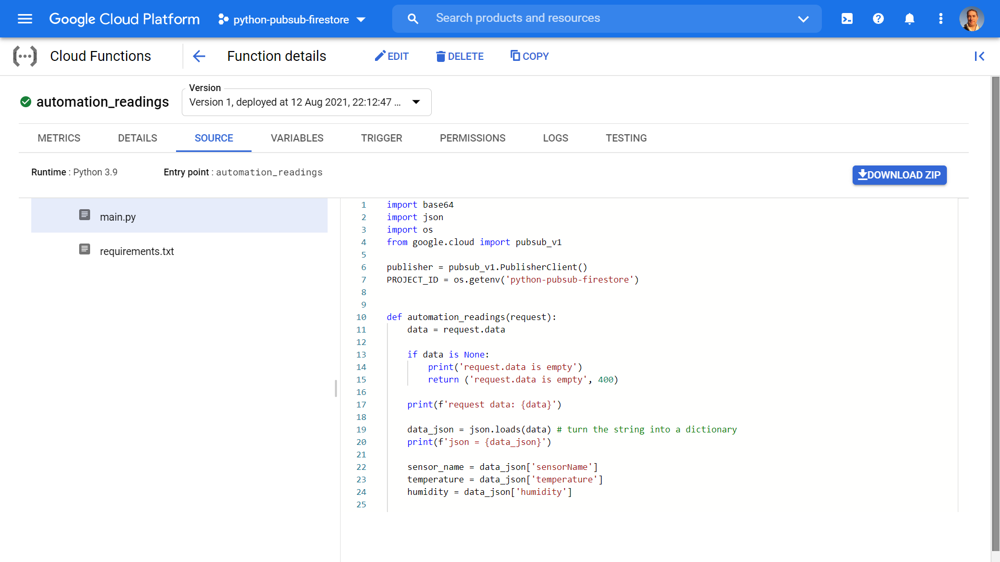
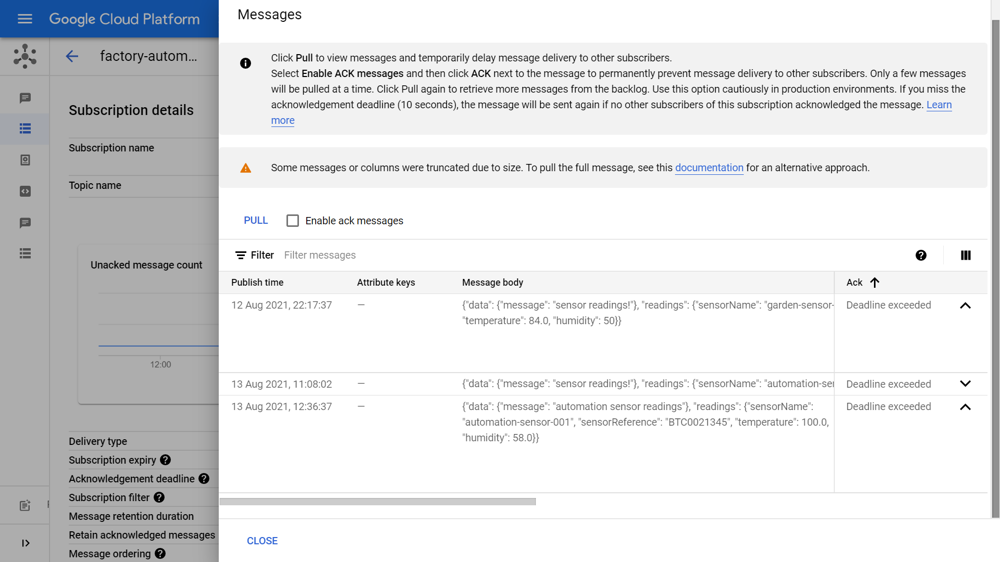
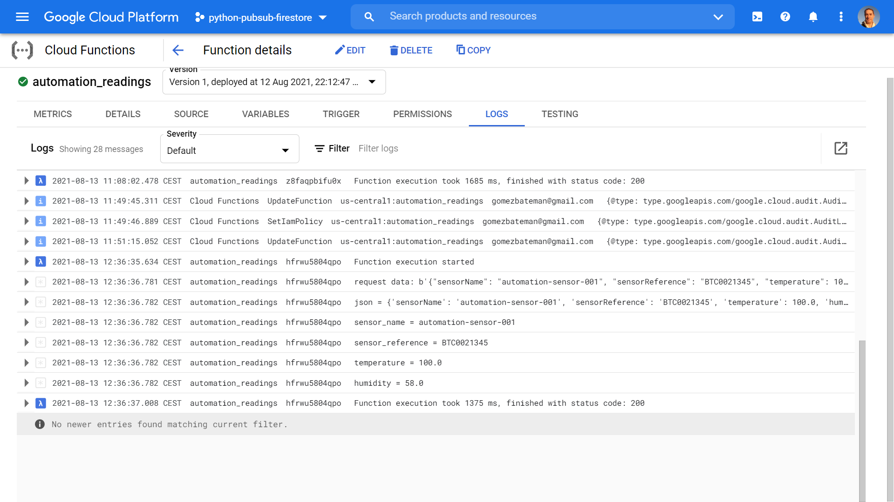

# :zap: Python Functions Pub/Sub

* Google Cloud Functions used to send data using Python code to Google Cloud Pub/Sub where data can be published with a message
* Code from [D-I-Ry](https://www.youtube.com/channel/UCMHvK9tare9Y9O152C9wm3Q) with modifications - see [:clap: Inspiration](#clap-inspiration) below
* **Note:** to open web links in a new window use: _ctrl+click on link_


* [:zap: Python Functions Pub/Sub](#zap-python-functions-pubsub)
  * [:page_facing_up: Table of contents](#page_facing_up-table-of-contents)
  * [:books: General info](#books-general-info)
  * [:camera: Screenshots](#camera-screenshots)
  * [:signal_strength: Technologies](#signal_strength-technologies)
  * [:floppy_disk: Setup](#floppy_disk-setup)
  * [:computer: Code Examples](#computer-code-examples)
  * [:cool: Features](#cool-features)
  * [:clipboard: Status & To-do list](#clipboard-status--to-do-list)
  * [:clap: Inspiration](#clap-inspiration)
  * [:envelope: Contact](#envelope-contact)

## :books: General info

* Pub/Sub used to pass messages between services and to trigger Cloud Functions to run workflow
* To subscribe to data in Cloud Pub/Sub, you create a subscription based on the topic, and subscribe to that, passing a callback function.
* Python code deployed from VS Code terminal
* Cloud Build API has to be enabled for deployment to work. Mine was already enabled from a similar previous project
* From Pub/Sub factor-sensors topic is triggered by message published to pubsub factory sensors topic

## :camera: Screenshots





## :signal_strength: Technologies

* [Python v3](https://www.python.org/) programming language
* [Python Cloud Client Libraries](https://cloud.google.com/python/docs/reference)
* [JavaScript Object Notation - JSON](https://www.json.org/json-en.html) lightweight data-interchange format
* [Google Cloud Functions](https://cloud.google.com/functions) functions as a service (FaaS) to run Python code
* [Google Cloud Pub/Sub](https://cloud.google.com/pubsub) a fully-managed real-time messaging service that allows you to send and receive messages between independent applications.
* [Google Cloud FireStore](https://cloud.google.com/firestore) fully managed, scalable, and serverless document database.

## :floppy_disk: Setup

* Ref. tutorial
* When creating a Pub/Sub I found that the subscription was created automatically
* `gcloud functions deploy automation_readings --runtime python39 --trigger-http --allow-unauthenticated` to deploy to Cloud Functions. Python code can be viewed in Cloud Functions `automation_readings` SOURCE menu. Message logs can be viewed under the LOGS menu. Logs can also be viewed in Firebase Console Logs menu.
* `python sendMessage.py` to run `sendMessage.py`. This will trigger the Cloud Function using a http trigger URL and will supply sensor readings payload data in JSON format to the Cloud Functions Topic `automation_readings`. A response is returned with a status code. Clicking on 'PULL' in Cloud Pubsub Topic Messages will display message

## :computer: Code Examples

* `main.py` extract - to move data to Pubsub. Topic path copied from Cloud Pub/Sub Subscription Details/Topic name

```python
    topic_path = 'projects/python-pubsub-firestore/topics/factory-automation'

    message_json = json.dumps({
        'data': {'message': 'automation sensor readings'},
        'readings': {
            'sensorName': sensor_name,
            'sensorReference': sensor_reference,
            'temperature': temperature,
            'humidity': humidity
        }
    })
    message_bytes = message_json.encode('utf-8')

    try:
        publish_future = publisher.publish(topic_path, data=message_bytes)
        publish_future.result() # verify that the publish succeeded
    except Exception as e:
        print(e)
        return (e, 500)

    return ('Message received and published to Pubsub', 200)
```

## :cool: Features

* Cloud Pub/Sub decoupling senders and receivers, allowing secure and highly available communications between independently written applications.

## :clipboard: Status & To-do list

* Status: Working
* To-do: Nothing

## :clap: Inspiration

* [D-I-Ry: Send data from Cloud Functions to PubSub in Python](https://www.youtube.com/watch?v=IjfRb5BKQaI)

## :envelope: Contact

* Repo created by [ABateman](https://github.com/AndrewJBateman), email: gomezbateman@yahoo.com
